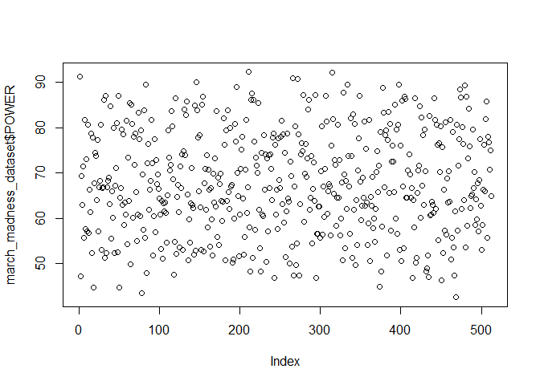

<!-- README.md is generated from README.Rmd. Please edit that file -->

# marchmadness

<!-- badges: start -->
<!-- badges: end -->

The goal of marchmadness is to analyze each team’s performance and
determine whether historical performance will have an effect on public
picks for each team. Thus, this dataset could give you an insight and
enable you have a prediction on the final ranking of each team.

## Installation

You can install the development version of marchmadness from
[GitHub](https://github.com/ETC5523-2024/assignment-4-packages-and-shiny-apps-Vincent0153/tree/main/marchmadness)
with:

``` r
# install.packages("pak")
pak::pak("ETC5523-2024/assignment-4-packages-and-shiny-apps-Vincent0153/tree/main/marchmadness")
```

## Example

This is a basic example which shows you how to solve a common problem:

``` r
library(marchmadness)
data("march_madness_dataset")
## basic example code
```

What is special about using `README.Rmd` instead of just `README.md`?
You can include R chunks like so:

``` r
summary(march_madness_dataset)
#>       YEAR          TEAMNO           TEAM                SEED      
#>  Min.   :2016   Min.   : 536.0   Length:512         Min.   : 1.00  
#>  1st Qu.:2018   1st Qu.: 671.8   Class :character   1st Qu.: 4.75  
#>  Median :2020   Median : 807.5   Mode  :character   Median : 8.50  
#>  Mean   :2020   Mean   : 807.9                      Mean   : 8.50  
#>  3rd Qu.:2022   3rd Qu.: 943.2                      3rd Qu.:12.25  
#>  Max.   :2024   Max.   :1079.0                      Max.   :16.00  
#>                                                                    
#>      ROUND           POWER           FINALS      
#>  Min.   : 0.00   Min.   :42.50   Min.   : 0.030  
#>  1st Qu.:16.00   1st Qu.:59.80   1st Qu.: 0.050  
#>  Median :32.00   Median :66.85   Median : 0.115  
#>  Mean   :37.34   Mean   :67.77   Mean   : 1.562  
#>  3rd Qu.:64.00   3rd Qu.:77.08   3rd Qu.: 0.640  
#>  Max.   :64.00   Max.   :92.30   Max.   :34.920  
#>                                  NA's   :448
```

You’ll still need to render `README.Rmd` regularly, to keep `README.md`
up-to-date. `devtools::build_readme()` is handy for this.

You can also embed plots, for example:



In that case, don’t forget to commit and push the resulting figure
files, so they display on GitHub and CRAN.
